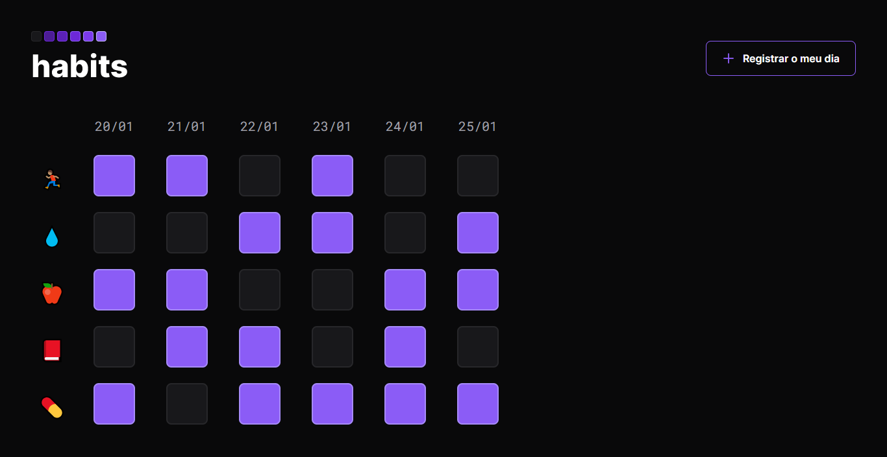

# Habit Control
Projeto criado através da plataforma Rocketseat no evento NLW Setup- Trilha Explorer

## Deploy da aplicação
https://habit-control-beta.vercel.app/

## Tecnologias utilizadas
+ HTML5
+ CSS3
+ JavaScript

## Estrutura do site
+ Botão: seção onde é possível registrar um novo dia
+ Checkbox: seção onde é possível ver os hábitos realizados em um determinado dia

## Home

